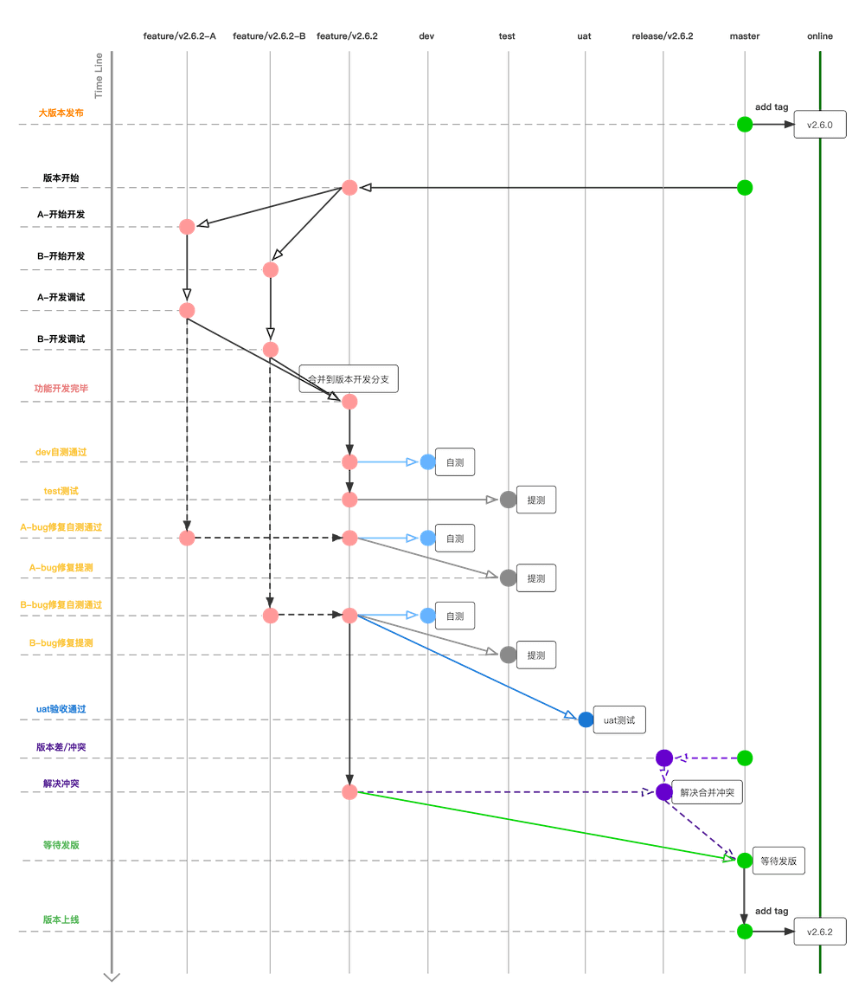
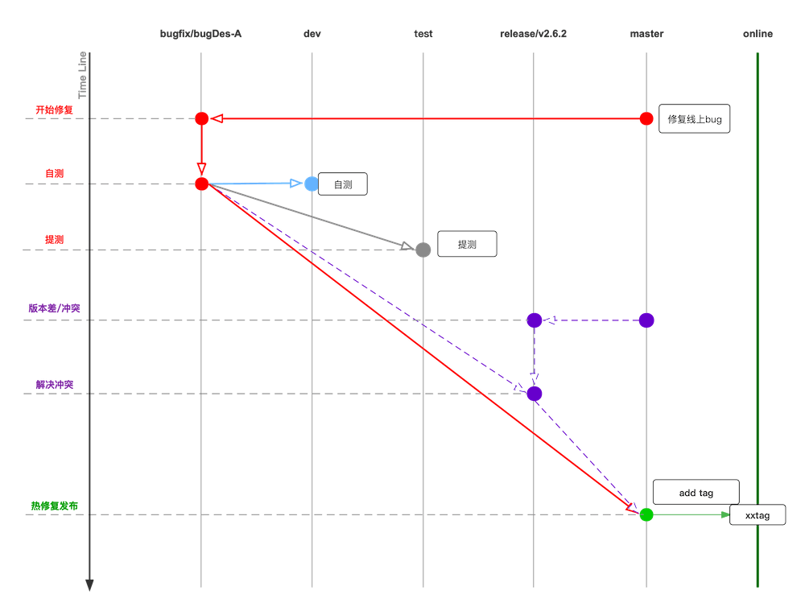

## 1，版本开发git操作流程

### 1.1 分支说明

| 分支名 | 对应环境 | 创建自 | 合并到 | 说明 |
| :---: | --- | --- | --- | --- |
| `master` | 生产环境 | `master` | `master` | 主分支，不轻易改动，主要做正式发版使用 |
| `release/**` |  | `master` | `master` | 临时解决冲突分支 |
| `test` | 测试环境 | `master` | | 测试同学介入测试分支 |
| `dev` | 开发环境 | `master` | | 开发同学自测分支 |
| `feature/{版本号/功能}` | 开发环境 | `master` | `dev`,`test`, `uat`,`release/**`, `master` | 具体的版本、需求开发主分支 |
| `feature/{版本号/功能}-A `| 开发环境 | `feature/{版本号/功能} ` | `feature/{版本号/功能} ` | 参与版本开发、需求开发的`A同学`开发分支 |
| `feature/{版本号/功能}-B` | 开发环境 | `feature/{版本号/功能} ` | `feature/{版本号/功能} ` | 参与版本开发、需求开发的`B同学`开发分支 |
<!-- | `uat` | 演练环境/预生产环境 | `master` | | 临时解决冲突分支 | -->

## 2， 线上bug修复git流程

