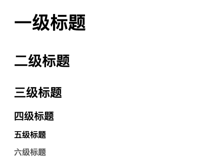
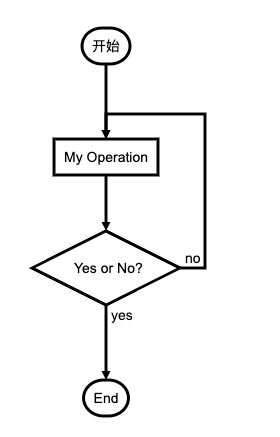
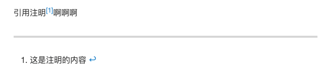
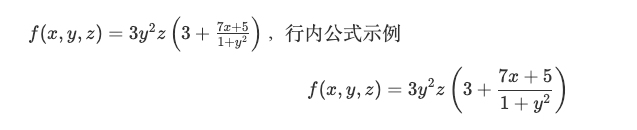

:::tip 简介
Markdown是一种纯文本格式的标记语言。通过简单的标记语法，它可以使普通文本内容具有一定的格式
:::
<!-- more -->

## 1，标题

Markdown 标题有两个格式。

### 1.1 使用 = 和 - 标记一级和二级标题

使用一个以上

```Markdown
这是一级标题
==========

这是二级标题
----------
```
显示效果如下：  


### 1.2 使用 # 标记

使用 # 号可表示 1-6 级标题，一级标题对应一个 # 号，二级标题对应两个 # 号，以此类推。

```Markdown
# 一级标题
## 二级标题
### 三级标题
#### 四级标题
##### 五级标题
###### 六级标题
```
显示效果如下：  



## 2，字体

Markdown 可以使用以下几种字体：

### 2.1 倾斜

```Markdown
*斜体文本*
_斜体文本_
<i>斜体文本</i>
```
显示效果如下：  

*斜体文本*
_斜体文本_
<i>斜体文本</i>

### 2.2 加粗

```Markdown
**粗体文本**
__粗体文本__
<b>粗体文本</b>
***粗斜体文本***
___粗斜体文本___
<b><i>粗体文本</i></b>
```
显示效果如下：  

**粗体文本**
__粗体文本__
<b>粗体文本</b>
***粗斜体文本***
___粗斜体文本___
<b><i>粗体文本</i></b>


### 2.3 下划线

```Markdown
<u>下划线字体</u>
```
显示效果如下：   

<u>下划线字体</u>

### 2.4 删除线

```Markdown
<s>删除线字体</s>
~~删除线字体~~
```
显示效果如下：   

<s>删除线字体</s>
~~删除线字体~~


## 3，引用

在引用的文字前加 `>` 即可。引用也可以嵌套，如加两个 >> 三个 >>> n个...  
貌似可以一直加下去

```Markdown
> 这是引用内容
>> 这是引用内容
>>>> 这是引用内容
>>>>>>>>>>>>>>>> 这是引用内容
```
显示效果如下：   

> 这是引用内容
>> 这是引用内容
>>> 这是引用内容
>>>> 这是引用内容


## 4，分割线

三个或者三个以上的 `-` 或者 `*` 都可以。

```Markdown
---
----
***
****
```
显示效果如下：   

---
----
***
****


## 5，列表

Markdown 支持 `有序列表` 和 `无序列表` 。

### 5.1 无序列表

无序列表使用星号`*`、加号`+`或是减号`-`作为列表标记
```Markdown
* 第一项
* 第二项
+ 第一项
+ 第二项
- 第一项
- 第二项
```
显示效果如下：   

* 第一项
* 第二项
+ 第一项
+ 第二项
- 第一项
- 第二项


### 5.2 有序列表

有序列表使用数字并加上 . 号来表示。  

```Markdown
1. 第一项
2. 第二项
3. 第三项
```
显示效果如下：   

1. 第一项
2. 第二项
3. 第三项

注意：序号跟内容之间要有空格

### 5.3 列表嵌套
上一级和下一级之间敲`三个或者四个`空格即可

```Markdown
* 第一项
   * 第一项第一个嵌套
   * 第一项第二个嵌套
+ 第二项
   + 第二项第一个嵌套
   + 第二项第二个嵌套
- 第三项
   - 第三项第一个嵌套
   - 第三项第二个嵌套
```
显示效果如下：   

* 第一项
   * 第一项第一个嵌套
   * 第一项第二个嵌套
+ 第二项
   + 第二项第一个嵌套
   + 第二项第二个嵌套
- 第三项
   - 第三项第一个嵌套
   - 第三项第二个嵌套

**有序无序嵌套**

```Markdown
1. 第一项
   1. 第一项第一个嵌套
   2. 第一项第二个嵌套
2. 第二项
   + 第二项第一个嵌套
   + 第二项第二个嵌套
3. 第三项
   - 第三项第一个嵌套
   - 第三项第二个嵌套
```
1. 第一项
   1. 第一项第一个嵌套
   2. 第一项第二个嵌套
2. 第二项
   + 第二项第一个嵌套
   + 第二项第二个嵌套
3. 第三项
   - 第三项第一个嵌套
   - 第三项第二个嵌套

## 6，表格

```Markdown
|表头|表头|表头|
|---|:--:|---:|
|内容111111|内容222222|内容333333|
|内容|内容|内容|
```
显示效果如下：   

|表头|表头|表头|
|---|:--:|---:|
|内容111111|内容222222|内容333333|
|内容|内容|内容|

* 第一行为表头。
* 第二行分割表头和内容，必须要。
    * `-` 有一个就行，为了对齐，多加了几个
    * 文字默认居左
        * 两边加`:`表示文字居中。
        * 右边加`:`表示文字居右。
* 所有的 `|`和`:`必须为英文符号。
* 原生的语法两边都要用`|`包起来。可以省略。

## 7，代码块

代码块是使用 反引号（`）包裹的起来的语句。  

注意，这里的括号是为了避免被转译

### 7.1 单行代码块

```Markdown
`单行代码内容`
```
显示效果如下：   

`单行代码内容`

### 7.2 多行代码块
多行代码块是使用 三个反引号 (```) 包裹一段代码，并指定一种语言（也可以不指定）
```Markdown
    ```Javascript
        let a = 1;
        let b = 2;
        console.log( a + b );
    ```

    ```Html
        <div class="box">
                <span>111</span>
                <span>222</span>
        </div>
    ```
```
显示效果如下：   
```Javascript
    let a = 1;
    let b = 2;
    console.log( a + b );
```

```Html
   <div class="box">
        <span>111</span>
        <span>222</span>
   </div>
```
注意，这里的括号是为了避免被转译。


## 8，图片

```Markdown
语法：


```
显示效果如下：  


## 9，超链接

```Markdown
语法：  
[超链接名](超链接地址 "超链接title")
示例:  
[简书](http://jianshu.com)
[百度](http://baidu.com)
```
显示效果如下：   
[简书](http://jianshu.com)
[百度](http://baidu.com)

注意：Markdown 本身语法不支持链接在新页面中打开，如果想要在新页面中打开的话可以用html语言的a标签代替。

```Markdown
语法：  
<a href="超链接地址" target="_blank" title=“超链接的title”>超链接名</a>

示例:
<a href="http://baidu.com" target="_blank">百度</a>
```
显示效果如下：  
<a href="http://baidu.com" target="_blank">百度</a>

### 高级链接

链接也可以用变量来代替，并在文档末尾附带变量地址。变量请使用英文中括号`[]`括起来。

```Markdown
这里是百度的地址[百度]

[百度]: http://baidu.com
```

这里是百度的地址[百度]  

[百度]: https://baidu.live

注意：变量地址需要与变量使用处使用空行隔开


## 10，流程图
```Markdown
    ```flow
        st=>start: 开始
        op=>operation: My Operation
        cond=>condition: Yes or No?
        e=>end
        st->op->cond
        cond(yes)->e
        cond(no)->op
    ```
```



## 11，脚注

```Markdown
引用注明[^1]啊啊啊
[^1]: 这是注明的内容
```
显示效果如下：   




## 12，换行

* 在Markdown中换行有两种方式实现：
    * Markdown 换行语法在一行的末尾添加`两个或多个空格`，然后按回车键，即可创建一个换行
    * 在一行的末尾添加 `<br>`


## 13， 支持 HTMl 元素 和 CSS 样式

不在 Markdown 涵盖范围之内的标签，都可以直接在文档里面用 HTML 撰写。
```Markdown
<u>下划线字体</u>
<p style="color:red;">这是一段红色的字</p>
<p>
   <span id="asdflj234234lj">18px的绿色字</span>
   <style>
      #asdflj234234lj {
         color:green;
         font-size:18px;
      }
   </style>
</p>
```
显示效果如下：   

<u>下划线字体</u>
<p style="color:red;">这是一段红色的字</p>
<p>
   <span id="asdflj234234lj">18px的绿色字</span>
   <style>
      #asdflj234234lj {
         color:green;
         font-size:18px;
      }
   </style>
</p>

复杂表格也可以使用 `html` 中的 `table` 来实现。例如：
```html
<table style="font-size:13px;text-align:center">
	<tr style="text-align:center;font-size:14px">
	    <th>表头1</th>
	    <th>表头2</th>
	    <th>表头3</th>
	    <th>表头4</th>
	</tr >
	<tr >
	    <td>第1列第1行</td>
	    <td>第1列第2行</td>
	    <td>第1列第3行</td>
	    <td>第1列第4行</td>
	</tr>
	<tr >
	    <td rowspan="2">第2列第1行</td>
	    <td colspan="2">合并</td>
	    <td rowspan="2">第2列第4行</td>
	</tr>
   <tr >
	    <td colspan="2">合并</td>
	</tr>
   <tr >
	    <td>第3列第1行</td>
	    <td>第3列第2行</td>
	    <td>第3列第3行</td>
	    <td>第3列第4行</td>
	</tr>
</table>
```
<table style="font-size:13px;text-align:center">
	<tr style="text-align:center;font-size:14px">
	    <th>表头1</th>
	    <th>表头2</th>
	    <th>表头3</th>
	    <th>表头4</th>
	</tr >
	<tr >
	    <td>第1列第1行</td>
	    <td>第1列第2行</td>
	    <td>第1列第3行</td>
	    <td>第1列第4行</td>
	</tr>
	<tr >
	    <td rowspan="2">第2列第1行</td>
	    <td colspan="2">合并</td>
	    <td rowspan="2">第2列第4行</td>
	</tr>
   <tr >
	    <td colspan="2">合并</td>
	</tr>
   <tr >
	    <td>第3列第1行</td>
	    <td>第3列第2行</td>
	    <td>第3列第3行</td>
	    <td>第3列第4行</td>
	</tr>
</table>


## 14，转义

Markdown 使用了很多特殊符号来表示特定的意义，如果需要显示特定的符号则需要使用转义字符，Markdown 使用反斜杠`\`转义特殊字符
```Markdown
**文本加粗** 
\*\* 正常显示星号 \*\*
```
显示效果如下：   

**文本加粗** 
\*\* 正常显示星号 \*\*

Markdown 支持以下这些符号前面加上反斜杠来帮助插入普通的符号：

```
\   反斜线
`   反引号
*   星号
_   下划线
{}  花括号
[]  方括号
()  小括号
#   井字号
+   加号
-   减号
.   英文句点
!   感叹号
```

## 15，公式

行内公式使用一个 `$`包裹，独立公式使用 两个 `$`包裹

```Markdown
$ f(x,y,z) = 3y^2z \left( 3+\frac{7x+5}{1+y^2} \right) $
$$ f(x,y,z) = 3y^2z \left( 3+\frac{7x+5}{1+y^2} \right) $$
```
显示效果如下：   



公式的用法太多，具体可以参考 [https://www.zybuluo.com/codeep/note/163962#mjx-eqn-eqsample](https://www.zybuluo.com/codeep/note/163962#mjx-eqn-eqsample)

## 16，大于号 小于号 空格

Markdown 中的`大于号`、`小于号`会被误认为html标签

|显示结果|描述|实体名称|
|:-:|:-:|:-:|
|&lt;|小于号|`&lt;`|
|&gt;|大于号|`&gt;`|
| |空格|`&nbsp;`|


## 17，vuepress 中的容器语法

```Markdown
简介：
:::tip 标题
简介内容简介内容简介内容简介内容简介内容
:::

警告：
:::warning 标题
警告内容警告内容警告内容警告内容警告内容
:::

危险：
:::danger 标题
内容内容内容内容内容内容内容内容内容
:::

引用：
:::theorem 标题
内容内容内容内容内容内容内容

:::right 来自
来自 [百度](https://www.baidu.com)
:::

展开详情：
:::details 点击查看详情
详情详情详情详情详情详情
:::
```
显示效果如下：   

:::tip 标题
简介内容简介内容简介内容简介内容简介内容
:::

:::warning 标题
警告内容警告内容警告内容警告内容警告内容
:::

:::danger 标题
内容内容内容内容内容内容内容内容内容
:::

:::theorem 标题
内容内容内容内容内容内容内容

:::right 标题
来自 [百度](https://www.baidu.com)
:::

:::details 点击查看详情
详情详情详情详情详情详情
:::

